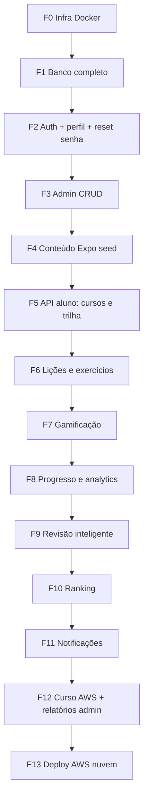

# Plano de Implementação — Duoling Mobile

**Versão:** 1.0  
**Atualizado:** Maio/2026  
**Estratégia:** Tudo via **Docker** primeiro. **AWS (nuvem)** só no final. Ordem **estrita por dependência** — não pular etapas.

---

## 1. Decisões confirmadas

| Tema | Decisão |
|------|---------|
| Acerto mínimo (RN03) | **70%** |
| Infra local | PostgreSQL + pgAdmin + API + Mobile + Admin + Mailhog — **docker compose** |
| Admin web | **Agora** — Next.js no Docker |
| Recuperação de senha (RF03) | **Implementar completo** — token + e-mail (Mailhog em dev) |
| Ranking (RF19, RN08) | **Implementar** — opt-in |
| Curso Expo | **Primeiro** (conteúdo + trilha + app) |
| Curso AWS | **Depois** (mesma stack, outro seed) |
| Deploy AWS (Lambda, API GW, Cognito, RDS…) | **Última fase** — após sistema estável no Docker |

---

## 2. Por que essa ordem faz sentido



- **Admin antes da trilha no app:** sem CRUD não há conteúdo estável (RF24–27).
- **API de trilha antes do mobile de lição:** contrato definido no backend.
- **Gamificação depois de concluir lição:** XP/streak dependem de `LessonCompletion`.
- **Ranking depois de XP/progresso:** precisa de dados agregados.
- **AWS nuvem por último:** não bloqueia entrega da disciplina; Docker replica o ambiente.

---

## 3. Stack Docker (alvo)

| Serviço | Porta | Função |
|---------|-------|--------|
| `db` | 5432 | PostgreSQL 15 |
| `pgadmin` | 5050 | Gestão do banco |
| `mailhog` | 1025 / 8025 | SMTP fake + UI de e-mails (reset senha) |
| `backend` | 8000 | FastAPI |
| `admin` | 3000 | Next.js — painel CRUD |
| `frontend` | 8081 | Expo (app aluno) |

Comando único: `docker compose up`

---

## 4. Trilha de implementação (passo a passo)

Cada passo só começa quando o anterior está **feito e testado** (checklist ✓).

---

### FASE 0 — Fundação Docker e projeto

**Objetivo:** Um comando sobe todo o ambiente; pastas e convenções definidas.

| # | Tarefa | Entrega | Depende de |
|---|--------|---------|------------|
| 0.1 | Adicionar serviço `mailhog` no `docker-compose.yml` | E-mails de dev capturados | — |
| 0.2 | Criar app `admin/` (Next.js 14+ App Router) + `Dockerfile` | Pasta admin | — |
| 0.3 | Adicionar serviço `admin` no compose (porta 3000, hot reload) | Admin no ar | 0.2 |
| 0.4 | Variáveis de ambiente documentadas (`.env.example`) | `DATABASE_URL`, `SECRET_KEY`, `SMTP_*` | 0.1 |
| 0.5 | Atualizar README com tabela de portas | Doc | 0.1–0.3 |

**Teste Fase 0:** `docker compose up` → todos os containers healthy; `http://localhost:8000/health` OK.

**RF/RNF:** RNF02, RNF08

---

### FASE 1 — Modelo de dados completo

**Objetivo:** Schema PostgreSQL cobre 100% do domínio (sem lógica de negócio ainda).

| # | Tarefa | Entrega | Depende de |
|---|--------|---------|------------|
| 1.1 | Model `Exercise` + migration/alembic ou create_all | Tabela exercícios | F0 |
| 1.2 | Model `LessonCompletion` | Conclusões por usuário/lição | 1.1 |
| 1.3 | Model `ExerciseAttempt` | Tentativas e erros | 1.1 |
| 1.4 | Model `PasswordResetToken` | Reset senha | F0 |
| 1.5 | Model `Achievement` + `UserAchievement` | Conquistas | F0 |
| 1.6 | Model `UserStreak` ou campos em User + `last_activity_at` | Streak | F0 |
| 1.7 | Model `ReviewQueueItem` | Fila revisão | 1.3 |
| 1.8 | User: `role` (student/admin), `avatar_url`, `ranking_opt_in` | Admin + ranking | F0 |
| 1.9 | Schemas Pydantic para todas as entidades | `schemas/` organizado | 1.1–1.8 |

**Teste Fase 1:** Tabelas visíveis no pgAdmin; `create_all` ou migration sem erro.

**RF:** base para RF10, RF13, RF18, RF19, RF22

---

### FASE 2 — Autenticação completa

**Objetivo:** Auth production-ready em Docker (inclui reset e perfil).

| # | Tarefa | Entrega | RF/US |
|---|--------|---------|-------|
| 2.1 | `POST /auth/forgot-password` — gera token, envia e-mail (Mailhog) | RF03 | |
| 2.2 | `POST /auth/reset-password` — valida token, atualiza senha | RF03 | |
| 2.3 | `PATCH /auth/me` — nome, avatar_url | RF04 | |
| 2.4 | `POST /auth/change-password` (logado) | RF04 | |
| 2.5 | Middleware/dep `require_admin` | Admin API | RF24+ |
| 2.6 | Mobile: telas forgot/reset password | US01 ext. | |
| 2.7 | Mobile: tela editar perfil | RF04 | |

**Teste Fase 2:** Fluxo completo no Mailhog UI; login após reset; perfil atualiza.

**Status atual:** RF01, RF02 ✅ — restante 🔲

---

### FASE 3 — Painel Admin (Next.js)

**Objetivo:** CRUD de conteúdo sem depender de SQL manual.

| # | Tarefa | Entrega | RF/US |
|---|--------|---------|-------|
| 3.1 | Layout admin + login (JWT admin) | Shell | — |
| 3.2 | `CRUD /admin/courses` backend | API | RF24, US20 |
| 3.3 | Página listar/criar/editar cursos | UI | RF24 |
| 3.4 | `CRUD /admin/modules` | API | RF25, US21 |
| 3.5 | UI módulos por curso (ordem drag ou input) | UI | RF25 |
| 3.6 | `CRUD /admin/lessons` | API | RF26, US22 |
| 3.7 | UI lições (conteúdo markdown/texto) | UI | RF26 |
| 3.8 | `CRUD /admin/exercises` | API | RF27, US23 |
| 3.9 | UI exercícios (tipo MCQ primeiro; depois V/F, etc.) | UI | RF27, RF13 |
| 3.10 | RN09: soft delete (`is_active`) em todas as entidades | Regra | RN09 |

**Teste Fase 3:** Criar curso "Expo" com 2 módulos, 3 lições, 5 MCQs só pelo admin.

**RF:** RF24–RF27

---

### FASE 4 — Conteúdo inicial curso Expo (seed)

**Objetivo:** Trilha utilizável para demonstração e testes.

| # | Tarefa | Entrega | Depende de |
|---|--------|---------|------------|
| 4.1 | Script `backend/scripts/seed_expo.py` | Módulos alinhados ao PRD §5 | F3 |
| 4.2 | Rodar seed via `docker compose exec backend python -m ...` | Dados no Postgres | 4.1 |
| 4.3 | Validar no admin e pgAdmin | Conteúdo OK | 4.2 |

**Módulos Expo (sugestão MVP):** Fundamentos → Componentes → Navegação (3 módulos, ~3 lições cada).

**Curso AWS:** **não** nesta fase — Fase 12.

---

### FASE 5 — API do aluno: cursos e trilha

**Objetivo:** Aluno vê cursos, inicia e vê trilha com bloqueios.

| # | Tarefa | Entrega | RF/US |
|---|--------|---------|-------|
| 5.1 | `GET /courses` | Lista Expo (+ AWS vazio ou locked) | RF05, US03 |
| 5.2 | `POST /courses/{id}/start` — cria `Progress` | RN01, RN02 | RF06, US04 |
| 5.3 | `trail_service` — status locked/available/current/completed | RN04 | RF08, RF09 |
| 5.4 | `GET /courses/{id}/trail` | Trilha JSON | US05, US06 |
| 5.5 | Mobile: lista de cursos | UI | US03 |
| 5.6 | Mobile: tela trilha visual | UI | US05, US06 |

**Teste Fase 5:** Novo usuário inicia Expo; só primeira lição desbloqueada; trilha reflete estado.

---

### FASE 6 — Lições e exercícios (app aluno)

**Objetivo:** Fluxo completo de uma lição com feedback e conclusão 70%.

| # | Tarefa | Entrega | RF/US |
|---|--------|---------|-------|
| 6.1 | `GET /lessons/{id}` — conteúdo + exercícios (sem gabarito) | RF11 | US07 |
| 6.2 | `POST /lessons/{id}/attempts` — feedback por exercício | RF12 | US08, US09 |
| 6.3 | `lesson_service.complete` — score, RN03 (≥70%) | RN03 | US10 |
| 6.4 | `POST /lessons/{id}/complete` — grava `LessonCompletion`, avança Progress | RF10 | US10 |
| 6.5 | Tipos MCQ + true_false (backend + mobile) | RF13 parcial | US08 |
| 6.6 | Mobile: lesson player (passo a passo) | UI | US07–US10 |
| 6.7 | RF14: permitir refazer lição (nova tentativa, melhor score opcional) | Média | RF14 |

**Teste Fase 6:** Concluir com 60% → não avança; com 80% → avança e desbloqueia próxima.

---

### FASE 7 — Gamificação

**Objetivo:** XP, nível, streak e conquistas após lição.

| # | Tarefa | Entrega | RF/US |
|---|--------|---------|-------|
| 7.1 | `gamification_service.award_xp` (RN06) | RF15 | US11 |
| 7.2 | Recalcular `level` no User | RF16 | US12 |
| 7.3 | `update_streak` (RN05) + `last_activity_at` | RF17 | US13 |
| 7.4 | Seed achievements + conceder em eventos | RF18 | US14 |
| 7.5 | Mobile: animação/resumo pós-lição (XP, streak) | UI | US11–US13 |
| 7.6 | Header app: nível + streak | UI | US12, US13 |

**Constantes:** `MIN_LESSON_ACCURACY = 0.70`, `BASE_XP = 10`, `BONUS_XP = 20`

---

### FASE 8 — Progresso e analytics

| # | Tarefa | Entrega | RF/US |
|---|--------|---------|-------|
| 8.1 | `GET /users/me/progress` — por curso e módulo | RF20 | US15 |
| 8.2 | `GET /users/me/stats` — taxa acerto, histórico | RF21 | US16 |
| 8.3 | Mobile: aba Progresso | UI | US15, US16 |

---

### FASE 9 — Revisão inteligente

| # | Tarefa | Entrega | RF/US |
|---|--------|---------|-------|
| 9.1 | Persistir erros em `ExerciseAttempt` | RF22 | US17 |
| 9.2 | `review_service` — prioridade por taxa de erro (RN07) | RF22 | US18 |
| 9.3 | `GET /review/suggestions` | UI lista | US18 |
| 9.4 | `POST /review/session` — exercícios personalizados | RF23 | US19 |
| 9.5 | Mobile: fluxo de revisão | UI | US19 |

---

### FASE 10 — Ranking

| # | Tarefa | Entrega | RF/US |
|---|--------|---------|-------|
| 10.1 | `PATCH /users/me` — `ranking_opt_in` (RN08) | RF19 | |
| 10.2 | `GET /ranking?period=weekly` — top XP (só opt-in) | RF19 | |
| 10.3 | Mobile: tela ranking + toggle participar | UI | |

---

### FASE 11 — Notificações

| # | Tarefa | Entrega | RF/US |
|---|--------|---------|-------|
| 11.1 | Model `NotificationPreference` | RF30 | US25 |
| 11.2 | Agendador simples (APScheduler no backend ou cron container) | RF29 | US24 |
| 11.3 | Expo Notifications — lembrete diário | RF29 | US24 |
| 11.4 | Mobile: configurações de notificação | RF30 | US25 |

*Nota:* em Docker/dev, notificação pode ser local + log; push real opcional até Fase 13.

---

### FASE 12 — Curso AWS + relatórios admin

| # | Tarefa | Entrega | RF/US |
|---|--------|---------|-------|
| 12.1 | Seed `seed_aws.py` (módulos do PRD AWS) | Curso 2 | RF05 |
| 12.2 | `GET /admin/reports` — usuários, lições/dia, retenção básica | RF28 | |
| 12.3 | Admin: dashboard de métricas | UI | RF28 |

---

### FASE 13 — Deploy AWS (nuvem) — ÚLTIMO

**Objetivo:** Migrar o que já funciona no Docker para AWS sem mudar regras de negócio.

| # | Tarefa | Entrega |
|---|--------|---------|
| 13.1 | RDS PostgreSQL (ou Aurora) — migrar schema |
| 13.2 | API FastAPI em Lambda + API Gateway (Mangum já existe) |
| 13.3 | S3 para avatares/assets |
| 13.4 | SES para e-mail produção (reset senha) |
| 13.5 | Cognito (opcional) substituindo JWT manual |
| 13.6 | Build Expo EAS — app stores |
| 13.7 | Admin Next.js na Vercel/Amplify ou ECS |
| 13.8 | CI/CD (GitHub Actions) |

**Não iniciar Fase 13** até Fases 0–12 testadas em Docker.

---

## 5. Mapa de features × fase

| Feature | Fase |
|---------|------|
| Docker completo (db, pgadmin, mailhog, api, admin, mobile) | 0 |
| Modelo dados completo | 1 |
| Cadastro/login | 2 (parcial ✅) |
| Reset senha + perfil | 2 |
| Admin CRUD | 3 |
| Seed Expo | 4 |
| Listar/iniciar curso + trilha | 5 |
| Lição + exercícios + 70% | 6 |
| XP, nível, streak, conquistas | 7 |
| Painel progresso + stats | 8 |
| Revisão inteligente | 9 |
| Ranking opt-in | 10 |
| Notificações | 11 |
| Curso AWS + relatórios | 12 |
| AWS cloud deploy | 13 |

---

## 6. Critério de “pronto” por fase

Para marcar uma fase como concluída:

1. **Checklist** da fase 100% ✓  
2. **Teste manual** documentado (1–2 linhas no PR do passo)  
3. **Sem regressão** nas fases anteriores (smoke: login, trilha, uma lição)  
4. Atualizar coluna **Status** em `.cursor/skills/duoling-requirements/reference.md`

---

## 7. Ordem de trabalho imediata (vocês estão aqui)

```
✅ Auth básica (register/login/me)
👉 PRÓXIMO: Fase 0 (mailhog + admin docker)
👉 Depois: Fase 1 (models)
👉 Depois: Fase 2 (reset senha + perfil)
👉 Depois: Fase 3 (admin CRUD)
   ...
```

**Não pular para trilha mobile antes do admin + seed Expo.**

---

## 8. Estimativa de esforço (referência)

| Fase | Complexidade | Observação |
|------|--------------|------------|
| 0 | Baixa | 0.5–1 dia |
| 1 | Média | 1–2 dias |
| 2 | Média | 1–2 dias |
| 3 | Alta | 3–5 dias |
| 4 | Baixa | 0.5 dia |
| 5 | Média | 2–3 dias |
| 6 | Alta | 3–4 dias |
| 7 | Média | 2 dias |
| 8 | Média | 1–2 dias |
| 9 | Média | 2–3 dias |
| 10 | Baixa | 1 dia |
| 11 | Média | 2 dias |
| 12 | Média | 2 dias |
| 13 | Alta | 3–5 dias (infra) |

Total ordem de grandeza: **4–6 semanas** em ritmo de projeto acadêmico com entregas incrementais.

---

## 9. Riscos e mitigação (cronograma apertado)

| Risco | Mitigação |
|-------|-----------|
| Fazer mobile antes do backend | Seguir fases 5→6 só após API pronta |
| Admin atrasar conteúdo | Fase 3 obrigatória antes de seed |
| Reset senha sem SMTP | Mailhog na Fase 0 |
| Scope creep na Fase 6 | MCQ + V/F primeiro; matching/código na 6.7+ |
| AWS cedo demais | Fase 13 bloqueada por checklist |

---

## 10. Referências

- [PRD](./PRD.md)
- [SDD](./SDD.md)
- [Requirements matrix](../.cursor/skills/duoling-requirements/reference.md)
