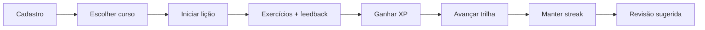

# PRD — Duoling Mobile

**Produto:** Plataforma de aprendizado gamificada (estilo Duolingo) para tecnologia  
**Versão:** 1.0  
**Última atualização:** Maio/2026  
**Repositório:** `duoling-mobile`

---

## 1. Visão do Produto

Oferecer uma experiência de aprendizado gamificada, inspirada no Duolingo, focada no ensino de tecnologia por meio de trilhas curtas, progressivas e interativas.

**Cursos iniciais:**

| Curso | Conteúdo principal |
|-------|-------------------|
| **Expo** | Fundamentos, componentes, navegação, APIs, armazenamento, build e deploy |
| **AWS Nuvem** | Cloud, IAM, S3, EC2, Lambda, API Gateway, DynamoDB |

**Pilares da experiência:** microlições, exercícios interativos, progressão por níveis, gamificação, revisão inteligente.

---

## 2. Problema

| Desafio | Impacto |
|---------|---------|
| Alta evasão em cursos online | Baixa conclusão |
| Dificuldade em manter constância | Abandono |
| Excesso de teoria | Pouca retenção |
| Pouca prática guiada | Gap teoria × prática |
| Falta de feedback imediato | Aprendizado lento |

---

## 3. Objetivos do Produto

- Aumentar retenção de alunos
- Incentivar prática contínua
- Oferecer aprendizado progressivo
- Utilizar gamificação para engajamento
- Permitir aprendizado autônomo com baixo acompanhamento

---

## 4. Público-Alvo

- Estudantes de ADS / Engenharia
- Iniciantes em desenvolvimento mobile (Expo/React Native)
- Iniciantes em cloud computing (AWS)

---

## 5. Escopo e Funcionalidades

### 5.1 Autenticação

| ID | Funcionalidade | Prioridade | User Story |
|----|----------------|------------|------------|
| RF01 | Cadastro (email + senha) | Alta | US01 |
| RF02 | Login | Alta | US02 |
| RF03 | Recuperação de senha | Média | — |
| RF04 | Edição de perfil (nome, foto) | Média | — |

### 5.2 Cursos e Trilhas

| ID | Funcionalidade | Prioridade | User Story |
|----|----------------|------------|------------|
| RF05 | Listar cursos (Expo, AWS) | Alta | US03 |
| RF06 | Iniciar curso | Alta | US04 |
| RF07 | Progresso independente por curso | Alta | US04, US15 |
| RF08 | Trilha visual (módulos/lições) | Alta | US05 |
| RF09 | Bloqueio por pré-requisito | Alta | US06 |
| RF10 | Estrutura Curso → Módulo → Lição | Alta | — |

### 5.3 Lições e Exercícios

| ID | Funcionalidade | Prioridade | User Story |
|----|----------------|------------|------------|
| RF11 | Executar lição | Alta | US07 |
| RF12 | Feedback imediato | Alta | US09 |
| RF13 | Tipos: múltipla escolha, V/F, associação, código, ordenar | Alta | US08 |
| RF14 | Repetir lição | Média | — |

### 5.4 Gamificação

| ID | Funcionalidade | Prioridade | User Story |
|----|----------------|------------|------------|
| RF15 | XP por lição | Alta | US11 |
| RF16 | Nível do usuário | Média | US12 |
| RF17 | Streak diário | Alta | US13 |
| RF18 | Conquistas | Média | US14 |
| RF19 | Ranking (opcional) | Baixa | — |

### 5.5 Progresso e Analytics

| ID | Funcionalidade | Prioridade | User Story |
|----|----------------|------------|------------|
| RF20 | Painel de progresso | Alta | US15 |
| RF21 | Taxa de acerto | Média | US16 |

### 5.6 Revisão Inteligente

| ID | Funcionalidade | Prioridade | User Story |
|----|----------------|------------|------------|
| RF22 | Sugerir revisão por erros | Alta | US17, US18 |
| RF23 | Exercícios de revisão personalizados | Média | US19 |

### 5.7 Administração

| ID | Funcionalidade | Prioridade | User Story |
|----|----------------|------------|------------|
| RF24 | CRUD cursos | Alta | US20 |
| RF25 | CRUD módulos | Alta | US21 |
| RF26 | CRUD lições | Alta | US22 |
| RF27 | CRUD exercícios | Alta | US23 |
| RF28 | Relatórios de uso | Média | — |

### 5.8 Engajamento

| ID | Funcionalidade | Prioridade | User Story |
|----|----------------|------------|------------|
| RF29 | Notificações (lembretes) | Média | US24 |
| RF30 | Configurar notificações | Baixa | US25 |

---

## 6. Regras de Negócio

| ID | Regra | Prioridade |
|----|-------|------------|
| RN01 | Usuário pode cursar Expo e AWS simultaneamente | Alta |
| RN02 | Progresso é independente por curso | Alta |
| RN03 | Lição só conclui com acerto mínimo (ex.: 70%) | Alta |
| RN04 | Desbloqueio progressivo (lição N+1 após N) | Alta |
| RN05 | Streak exige atividade diária; reseta se faltar | Alta |
| RN06 | XP baseado em acertos e conclusão | Média |
| RN07 | Revisão prioriza exercícios com mais erros | Alta |
| RN08 | Ranking é opt-in | Baixa |
| RN09 | Alterações de conteúdo não apagam progresso do usuário | Alta |

---

## 7. Requisitos Não Funcionais

| ID | Requisito | Categoria | Prioridade |
|----|-----------|-----------|------------|
| RNF01 | Resposta rápida nas operações | Sistema | Alta |
| RNF02 | Mobile e web | UI | Alta |
| RNF03 | Proteção de dados do usuário | Segurança | Alta |
| RNF04 | Suportar crescimento de usuários | Infra | Alta |
| RNF05 | Alta disponibilidade | Infra | Alta |
| RNF06 | Novos cursos sem refatoração grande | Arquitetura | Alta |
| RNF07 | Interface acessível | UI | Média |
| RNF08 | Evolução e manutenção simples | Sistema | Alta |

---

## 8. Jornada do Usuário

1. Criar conta  
2. Escolher curso (Expo ou AWS)  
3. Iniciar primeira lição  
4. Realizar exercícios com feedback  
5. Ganhar XP e atualizar progresso  
6. Avançar na trilha (desbloqueio progressivo)  
7. Manter streak diário  
8. Receber sugestões de revisão  

---

## 9. User Stories (Épicos)

### Épico 1 — Autenticação

- **US01** Cadastro: email/senha válidos criam conta; email duplicado retorna erro.
- **US02** Login: credenciais corretas acessam o sistema; inválidas exibem erro.

### Épico 2 — Cursos e Trilhas

- **US03** Visualizar cursos Expo e AWS.
- **US04** Iniciar curso: cria progresso e libera trilha.
- **US05** Visualizar trilha: módulos, lições, bloqueios, progresso atual.
- **US06** Desbloqueio: lição só libera após anterior concluída.

### Épico 3 — Lições e Exercícios

- **US07** Iniciar lição: carrega exercícios e instruções.
- **US08** Responder exercício: seleção e avanço.
- **US09** Feedback imediato: correto/incorreto + explicação ao errar.
- **US10** Concluir lição: valida acerto mínimo, registra conclusão, atualiza progresso.

### Épico 4 — Gamificação

- **US11** XP ao concluir lição.
- **US12** Nível sobe automaticamente com XP.
- **US13** Streak incrementa no dia; reseta se não estudar.
- **US14** Conquistas por dias consecutivos e módulos concluídos.

### Épico 5 — Progresso

- **US15** Painel: progresso por curso e módulo.
- **US16** Histórico de lições com desempenho.

### Épico 6 — Revisão Inteligente

- **US17** Registrar erros e taxa por exercício.
- **US18** Sugerir conteúdos frágeis.
- **US19** Gerar exercícios de revisão personalizados.

### Épico 7 — Administração

- **US20–US23** CRUD de cursos, módulos, lições e exercícios.

### Épico 8 — Notificações

- **US24** Lembrete diário de estudo.
- **US25** Preferências de notificação.

---

## 10. Métricas de Sucesso (KPIs)

| Métrica | Descrição |
|---------|-----------|
| Retenção D1/D7/D30 | Usuários que retornam após 1, 7 e 30 dias |
| Lições/usuário | Média de lições concluídas |
| Conclusão de módulos | % de módulos finalizados |
| Tempo diário | Minutos médios de uso/dia |
| Taxa de acerto | Por exercício e lição |
| Streak ativo | % de usuários com streak > 0 |

---

## 11. Escopo de entrega (atualizado)

**Infra:** 100% via Docker (PostgreSQL, pgAdmin, Mailhog, API, Admin, Mobile) até validação completa.  
**Deploy AWS (Lambda, RDS, etc.):** apenas após sistema estável local — ver [IMPLEMENTATION_PLAN.md](./IMPLEMENTATION_PLAN.md).

### Inclui (entrega completa em Docker)

- Auth completa: cadastro, login, **recuperação de senha**, edição de perfil (RF01–RF04)
- **Painel admin Next.js** com CRUD cursos/módulos/lições/exercícios (RF24–RF27)
- Trilha Expo primeiro; **curso AWS** após Expo validado
- Lições, exercícios (MCQ + V/F no mínimo), feedback, conclusão com **70%** (RF11–RF14, RN03)
- Gamificação: XP, nível, streak, conquistas (RF15–RF18)
- Progresso e taxa de acerto (RF20–RF21)
- Revisão inteligente (RF22–RF23)
- **Ranking com opt-in** (RF19, RN08)
- Notificações e preferências (RF29–RF30)
- Relatórios admin (RF28)

### Por último (nuvem AWS)

- Migração para Lambda, API Gateway, RDS, SES, etc. (não bloqueia desenvolvimento local)

---

## 12. Roadmap

Trilha detalhada passo a passo: **[IMPLEMENTATION_PLAN.md](./IMPLEMENTATION_PLAN.md)** (Fases 0–13).

| Marco | Entregas |
|-------|----------|
| **F0–F2** | Docker completo, banco, auth + reset senha |
| **F3–F4** | Admin CRUD + seed Expo |
| **F5–F6** | Trilha e lições no app |
| **F7–F11** | Gamificação, progresso, revisão, ranking, notificações |
| **F12** | Curso AWS + relatórios |
| **F13** | Deploy AWS nuvem |

---

## 13. Riscos

| Risco | Mitigação |
|-------|-----------|
| Baixa retenção inicial | Gamificação + microlições + feedback imediato |
| Conteúdo insuficiente | Admin CRUD + seed de cursos |
| Gamificação desbalanceada | RN06 documentada; ajuste por métricas |
| Complexidade no backend | FastAPI modular; MVP enxuto |
| Atualização de conteúdo | RN09 — versionamento sem apagar progresso |

---

## 14. Referências

- [SDD](./SDD.md) — design técnico e APIs
- [Requisitos detalhados](../.cursor/skills/duoling-requirements/reference.md) — matriz RF ↔ US ↔ RN
