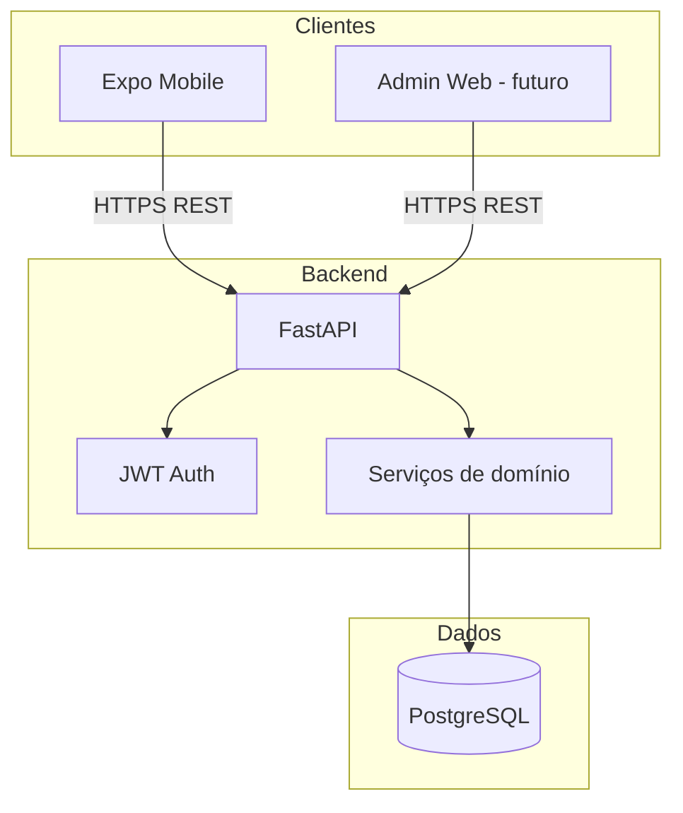
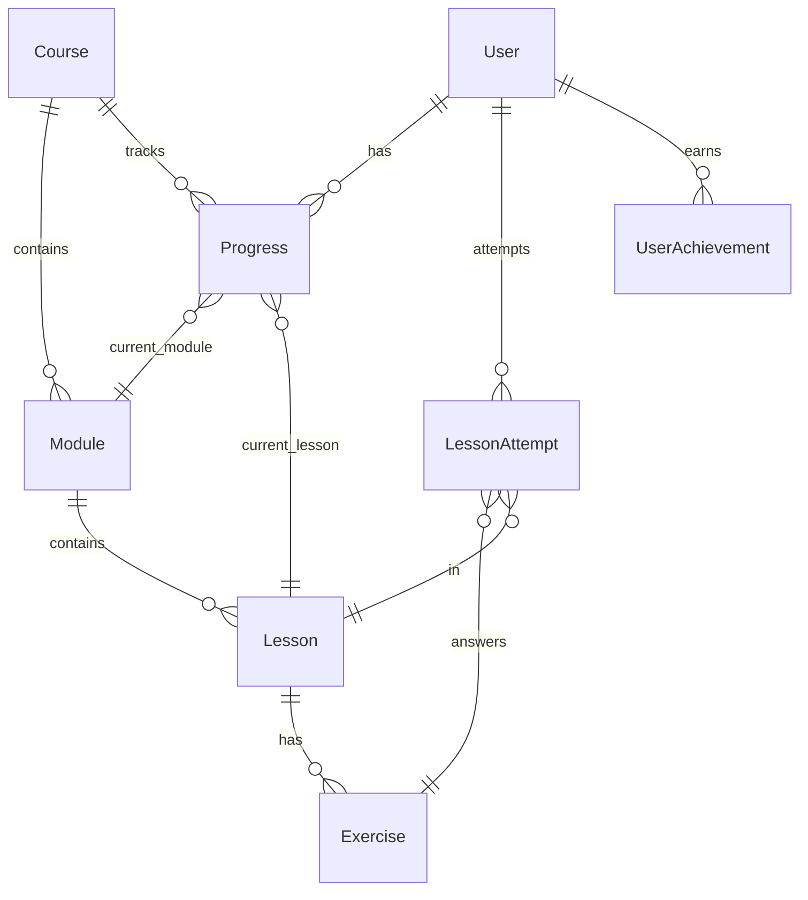

# SDD — Duoling Mobile

**Software Design Document**  
**Versão:** 1.0  
**Última atualização:** Maio/2026  
**PRD relacionado:** [PRD.md](./PRD.md)

---

## 1. Visão Geral do Sistema

Plataforma cliente-servidor para aprendizado gamificado:

| Camada | Tecnologia | Responsabilidade |
|--------|------------|------------------|
| **Mobile** | Expo (React Native) + Expo Router + NativeWind | App do aluno: auth, trilha, lições, gamificação |
| **Admin** | Next.js (Docker `:3000`) | CRUD de conteúdo e relatórios |
| **API** | FastAPI (Python 3.12+) | Regras de negócio, auth JWT, progresso, gamificação |
| **Dados** | PostgreSQL 15 | Persistência relacional |
| **Deploy (opcional)** | AWS Lambda + API Gateway + Mangum | API serverless |

**Estado atual do repositório:** auth implementada (register, login, me); modelos base de `Course`, `Module`, `Lesson`, `Progress`; rotas de conteúdo e gamificação **pendentes**.

---

## 2. Arquitetura

### 2.1 Diagrama de contexto



### 2.2 Estrutura de diretórios

```
duoling-mobile/
├── backend/
│   ├── main.py              # App FastAPI + Mangum handler
│   ├── auth.py              # JWT, bcrypt, get_current_user
│   ├── database.py          # SQLAlchemy engine/session
│   ├── models.py            # Entidades ORM
│   ├── schemas.py           # Pydantic DTOs
│   └── routes/
│       ├── auth_routes.py   # ✅ Implementado
│       ├── courses_routes.py    # 🔲 Planejado
│       ├── lessons_routes.py    # 🔲 Planejado
│       ├── progress_routes.py   # 🔲 Planejado
│       └── admin_routes.py      # 🔲 Planejado
├── mobile/
│   ├── app/                 # Expo Router (file-based)
│   │   ├── (auth)/          # login, register
│   │   └── (tabs)/          # home, explore, ...
│   ├── contexts/            # AuthContext
│   └── services/api.ts      # Cliente HTTP
├── docs/                    # PRD, SDD
├── docker-compose.yml       # postgres + backend + expo
└── .cursor/skills/          # Skills do Cursor
```

### 2.3 Decisões arquiteturais (ADRs resumidos)

| Decisão | Escolha | Justificativa |
|---------|---------|---------------|
| Backend | **FastAPI + SQLAlchemy** | Já no repo; tipagem, OpenAPI, produtividade |
| Banco | **PostgreSQL** | Relacional, joins para trilha/progresso, docker-compose pronto |
| Auth | **JWT (HS256) + bcrypt** | Simples para MVP; Cognito opcional na Fase 3 |
| Mobile | **Expo Router** | Navegação declarativa, OTA, multiplataforma |
| Estilo mobile | **NativeWind (Tailwind)** | Consistência visual rápida |
| Deploy API | **Mangum + Lambda** | `handler` já exposto em `main.py` |
| Admin | **Next.js no Docker** | Mesmo backend; login admin (`role=admin`) |
| E-mail dev | **Mailhog** | Reset de senha em desenvolvimento |
| Deploy prod | **AWS (Fase 13)** | Após validação total em Docker |

---

## 3. Modelo de Dados

### 3.1 Diagrama ER (alvo)



### 3.2 Entidades — implementadas

```python
# backend/models.py (resumo)
User       # id, email, name, hashed_password, xp, level, streak
Course     # id, title, description, is_active
Module     # id, course_id, title, order
Lesson     # id, module_id, title, order, content
Progress   # id, user_id, course_id, current_module_id, current_lesson_id
```

### 3.3 Entidades — a implementar (MVP+)

| Entidade | Campos principais | RF/RN |
|----------|-------------------|-------|
| **Exercise** | id, lesson_id, type, question, options (JSON), correct_answer, explanation | RF13, RF27 |
| **LessonCompletion** | user_id, lesson_id, score, completed_at, xp_earned | RF10, RN03 |
| **ExerciseAttempt** | user_id, exercise_id, is_correct, answered_at | RF22, US17 |
| **UserStreak** | user_id, current_streak, last_activity_date | RF17, RN05 |
| **Achievement** | id, code, title, criteria | RF18 |
| **UserAchievement** | user_id, achievement_id, earned_at | RF18 |
| **ReviewQueue** | user_id, exercise_id, priority, due_at | RF22, RN07 |

### 3.4 Tipos de exercício (`Exercise.type`)

| Valor | Descrição | MVP |
|-------|-----------|-----|
| `multiple_choice` | Uma resposta correta | ✅ |
| `true_false` | Verdadeiro ou falso | Fase 2 |
| `matching` | Associar pares | Fase 2 |
| `fill_code` | Completar trecho | Fase 2 |
| `ordering` | Ordenar passos | Fase 2 |

`options` e `correct_answer` armazenados como **JSON** no PostgreSQL para flexibilidade (RNF06).

---

## 4. Regras de Negócio (implementação)

### 4.1 Progresso e desbloqueio (RN02, RN04)

- Uma linha `Progress` por par `(user_id, course_id)`.
- Lição `L` desbloqueada se:
  - `L.order == 1` no módulo e módulo é o primeiro **ou**
  - lição anterior no mesmo módulo está em `LessonCompletion` **ou**
  - última lição do módulo anterior concluída (para primeira lição do módulo N+1).
- `current_lesson_id` / `current_module_id` atualizados ao concluir lição.

### 4.2 Conclusão de lição (RN03)

```
score = acertos / total_exercícios
concluída = score >= MIN_ACCURACY  # default 0.70
```

Se não atingir mínimo: não cria `LessonCompletion`, não avança trilha, pode permitir repetir (RF14).

### 4.3 XP e nível (RN06, RF15, RF16)

```
xp_lição = BASE_XP + (score * BONUS_XP)   # ex.: BASE=10, BONUS=20
user.xp += xp_lição
user.level = floor(sqrt(user.xp / 100)) + 1   # curva simples; ajustável
```

### 4.4 Streak (RN05, RF17)

- Ao concluir qualquer lição no dia (timezone UTC ou configurável):
  - Se `last_activity_date == ontem` → `streak += 1`
  - Se `last_activity_date == hoje` → mantém
  - Caso contrário → `streak = 1`
- Job diário ou checagem no login: se última atividade < ontem → `streak = 0`.

### 4.5 Revisão inteligente (RN07, RF22)

- Cada erro incrementa peso do exercício para o usuário.
- `priority = error_count / attempts` (simplificado MVP).
- Retornar top N exercícios com maior priority para sessão de revisão.

### 4.6 Conteúdo admin (RN09)

- Soft delete: `is_active = false` em Course/Module/Lesson/Exercise.
- Nunca deletar `LessonCompletion` / `Progress` em cascata por edição de conteúdo.
- Alterar ordem: recalcular desbloqueio sem apagar histórico.

---

## 5. API REST

**Base URL:** `http://localhost:8000` (dev)  
**Auth:** `Authorization: Bearer <token>`  
**Prefixo de tags OpenAPI:** por domínio

### 5.1 Autenticação — ✅ implementado

| Método | Rota | Descrição |
|--------|------|-----------|
| POST | `/auth/register` | Cadastro (RF01) |
| POST | `/auth/login` | Login → JWT (RF02) |
| GET | `/auth/me` | Perfil + xp/level/streak |

### 5.2 Cursos e trilha — 🔲 planejado

| Método | Rota | Descrição | RF |
|--------|------|-----------|-----|
| GET | `/courses` | Lista cursos ativos | RF05 |
| POST | `/courses/{id}/start` | Cria Progress | RF06 |
| GET | `/courses/{id}/trail` | Módulos, lições, locks, progresso | RF08, RF09 |

**Resposta exemplo `GET /courses/{id}/trail`:**

```json
{
  "course_id": 1,
  "title": "Expo",
  "modules": [
    {
      "id": 1,
      "title": "Fundamentos",
      "order": 1,
      "lessons": [
        {
          "id": 1,
          "title": "O que é Expo?",
          "order": 1,
          "status": "completed",
          "locked": false
        },
        {
          "id": 2,
          "title": "Setup",
          "order": 2,
          "status": "current",
          "locked": false
        }
      ]
    }
  ]
}
```

`status`: `locked` | `available` | `current` | `completed`

### 5.3 Lições — 🔲 planejado

| Método | Rota | Descrição | RF |
|--------|------|-----------|-----|
| GET | `/lessons/{id}` | Conteúdo + exercícios (sem gabarito) | RF11 |
| POST | `/lessons/{id}/attempts` | Envia respostas, retorna feedback | RF12 |
| POST | `/lessons/{id}/complete` | Valida score, XP, streak, desbloqueio | RF10, US10 |

### 5.4 Progresso e gamificação — 🔲 planejado

| Método | Rota | Descrição | RF |
|--------|------|-----------|-----|
| GET | `/users/me/progress` | Progresso por curso | RF20 |
| GET | `/users/me/stats` | Taxa de acerto, histórico | RF21 |
| GET | `/users/me/achievements` | Conquistas | RF18 |
| GET | `/review/suggestions` | Fila de revisão | RF22 |

### 5.5 Admin — 🔲 planejado (Fase 2+)

| Método | Rota | RF |
|--------|------|-----|
| CRUD | `/admin/courses`, `/admin/modules`, ... | RF24–RF27 |
| GET | `/admin/reports` | RF28 |

Proteção: role `admin` no JWT ou API key separada.

---

## 6. Frontend Mobile

### 6.1 Navegação (Expo Router)

| Grupo | Rotas | Estado |
|-------|-------|--------|
| `(auth)` | login, register | ✅ |
| `(tabs)` | index (home), explore | 🔲 integrar cursos |
| `(course)` | `[courseId]/trail` | 🔲 |
| `(lesson)` | `[lessonId]/play` | 🔲 |

Guard de auth em `app/_layout.tsx`: redireciona para login se sem token.

### 6.2 Estado e API

- **AuthContext:** token em AsyncStorage (`@duoling:token`), `/auth/me` no boot.
- **api.ts:** `API_BASE_URL` por plataforma (Android emulator: `10.0.2.2`).
- Novos hooks sugeridos: `useCourses`, `useTrail`, `useLesson`.

### 6.3 Telas MVP (prioridade)

1. Lista de cursos (US03)  
2. Trilha visual com nós e cadeado (US05, US06)  
3. Player de lição: enunciado → MCQ → feedback (US07–US09)  
4. Resumo pós-lição: XP, streak (US10, US11, US13)  
5. Tab Progresso (US15)  

---

## 7. Segurança (RNF03)

| Item | Implementação |
|------|----------------|
| Senhas | bcrypt via `auth.hash_password` |
| Tokens | JWT HS256, `SECRET_KEY` em env |
| CORS | Configurado em `main.py` (restringir origins em produção) |
| Validação | Pydantic em todos os payloads |
| HTTPS | Obrigatório em produção (API Gateway / reverse proxy) |
| Dados sensíveis | Nunca retornar `hashed_password`; exercícios sem `correct_answer` até submit |

---

## 8. Infraestrutura e Deploy

### 8.1 Desenvolvimento local

```bash
docker compose up
# API: http://localhost:8000
# Docs: http://localhost:8000/docs
# Expo: http://localhost:8081
# pgAdmin: http://localhost:5050
```

### 8.2 Variáveis de ambiente

| Variável | Onde | Descrição |
|----------|------|-----------|
| `DATABASE_URL` | backend | PostgreSQL connection string |
| `SECRET_KEY` | backend | Chave JWT |
| `EXPO_PUBLIC_API_URL` | mobile (futuro) | URL da API em builds |

### 8.3 AWS (opcional)

- **Lambda:** `handler = Mangum(app)` em `main.py`
- **API Gateway:** proxy para Lambda
- **RDS PostgreSQL** ou Aurora Serverless em vez de container
- **S3:** assets de mídia das lições (futuro)
- **Cognito:** substituir JWT custom na Fase 3

---

## 9. Módulos do Backend (camada de serviço)

Organização recomendada ao expandir:

```
backend/
├── services/
│   ├── trail_service.py      # desbloqueio, status de lições
│   ├── lesson_service.py     # tentativas, score, conclusão
│   ├── gamification_service.py  # xp, level, streak, achievements
│   └── review_service.py     # fila de revisão
```

Cada rota permanece fina; regras RN centralizadas nos services (testáveis).

---

## 10. Testes

| Camada | Ferramenta | Foco |
|--------|------------|------|
| API | pytest + httpx | Auth, trail, conclusão, RN03 |
| Services | pytest unit | XP, streak, desbloqueio |
| Mobile | opcional Detox | Fluxo login → lição |

---

## 11. Mapeamento MVP × código

| Feature | Backend | Mobile |
|---------|---------|--------|
| RF01, RF02 | ✅ auth_routes | ✅ login, register |
| RF05–RF09 | 🔲 courses_routes | 🔲 telas trilha |
| RF11–RF12 | 🔲 lessons_routes | 🔲 lesson player |
| RF15–RF17 | 🔲 gamification_service | 🔲 UI XP/streak |
| RF20 | 🔲 progress_routes | 🔲 tab progresso |

---

## 12. Ordem de implementação

Seguir estritamente **[IMPLEMENTATION_PLAN.md](./IMPLEMENTATION_PLAN.md)** — não implementar trilha mobile antes de admin + seed Expo.

**Próximo passo:** Fase 0 (Mailhog + serviço admin no Docker).

---

## 13. Referências

- [PRD](./PRD.md)
- [IMPLEMENTATION_PLAN.md](./IMPLEMENTATION_PLAN.md)
- OpenAPI: `/docs` com servidor rodando
- Skills: `.cursor/skills/duoling-*`
